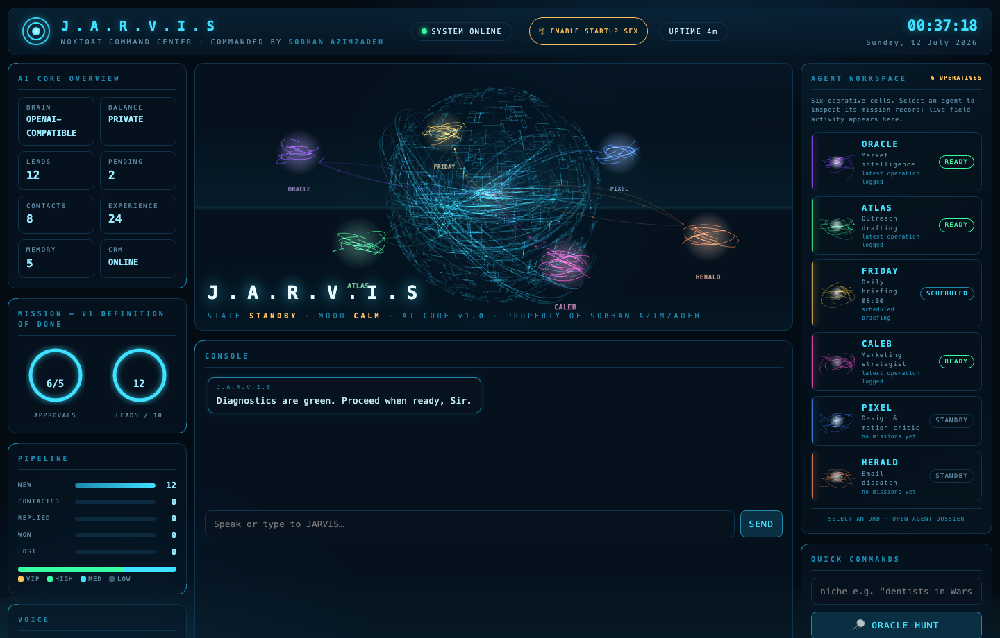
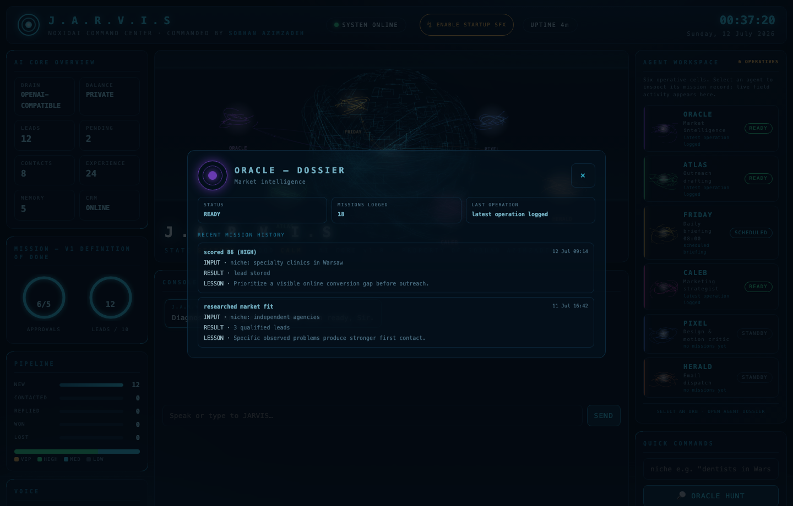
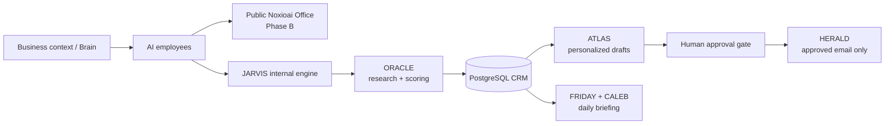

<div align="center">

  

  **AI employees for Iranian businesses — a visual office, one shared business brain, and real work getting done.**

  [](https://noxioai.com)
  [](docs/ROADMAP.md)
  [](jarvis/README.md)

</div>

---

NOXIOAI is building a Persian-first workspace where named AI employees help a business with marketing, development, support, and social operations. The product is designed for the channels that matter to its market, especially Telegram and Instagram, while keeping the business context shared through one **Brain**.

## What is working today

| Surface | Status | What it proves |
|---|---|---|
| [Noxioai landing](https://noxioai.com) | 🟢 Live | Bilingual FA-first landing (EN/FA/TR/AR), waitlist, brand identity |
| [Noxio Autopilot services](https://noxioai.com/services) | 🟢 Live | Fixed-price automation offer, 3 tiers, contact CTA |
| Signup / login / dashboard | 🟢 Live on Vercel | Session auth, verified end-to-end in production (signup → login → command center) |
| Transactional email | 🟢 Live | Verification + password-reset from `hi@noxioai.com` via Resend (domain-authenticated, inboxing) |
| [JARVIS engine](jarvis/README.md) | 🟢 24/7 in production | Go/Postgres sales OS on a dedicated VPS — briefing, inbox, outreach, nightly backups |
| Public Noxioai Office | ⬜ Planned | Shared Brain and pixel-office workflow |

JARVIS is the internal system that validates the useful parts first: research, personalized drafts, approval gates, delivery, daily briefings, and learning from outcomes. It now runs on the production server, not a laptop.

## Current product status

| Phase | Goal | Status |
|---|---|---|
| A — Launch | Landing and waitlist | 🟢 Live |
| B — The Office | Public visual office and shared Brain | 🔨 In progress — auth, billing, dashboard shell live; office UI next |
| C — Business | Automations, social tools, first outside users | 🔨 Noxio Autopilot offer live; first outreach in flight |
| D — Commercial | Billing, plans, PWA | 🟡 Stripe checkout/portal/webhooks built; needs live keys |

**Infrastructure (built 2026-07-15):**
- **Frontend:** Nuxt on Vercel (`noxioai.vercel.app`; apex cutover pending). `/api/*` reverse-proxied to the backend, so auth works same-origin.
- **Backend + engine:** Go API + JARVIS on a hardened Ubuntu VPS (key-only SSH, ufw, fail2ban, auto-updates), behind Caddy/TLS.
- **Database:** PostgreSQL on the VPS; nightly encrypted backups pushed to Telegram + 14-day local rotation.
- **Email:** Resend HTTPS API (the datacenter blocks SMTP), branded HTML template, `hi@noxioai.com`.
- **DR:** full rebuild runbook + server configs in [deploy/](deploy/) — any fresh VPS becomes production in ~20 min.

## What is left

- **DNS:** add `api.noxioai.com` A-record and point the apex domain `noxioai.com` at Vercel (currently GitHub Pages).
- **Rotate credentials** shared during setup (Resend key, xAI key, Gmail app password).
- **Stripe:** swap test keys for live keys to accept real payments.
- **CI/CD:** GitHub Action to auto-build and deploy the JARVIS binary on push.
- **Product:** the public Office UI (Phase B) and first outside users (Phase C).

**Platform build** ([PLATFORM-SPEC.md](PLATFORM-SPEC.md)): session auth ✅ · dashboard shell ✅ · Stripe billing (checkout, portal, webhooks) ✅ · auth emails ✅ · production deploy ✅ (Vercel + VPS) · apex DNS cutover 🔨

The detailed product plan lives in [docs/ROADMAP.md](docs/ROADMAP.md). The approved technology decisions live in [docs/TECH-STACK.md](docs/TECH-STACK.md).

## Latest activity

<!-- ACTIVITY:START -->
_Auto-updated 2026-07-16 07:19 UTC_

- `9103ec2` hero: luxury-minimal redesign — remove HUD console box/grid/status-chips, headline with champagne-gold accent, ambient free-floating sphere, gold CTA, more whitespace; premium-tech design system applied — 2026-07-16
- `cfbffe9` hero: luxury data-orb redesign — Fibonacci point sphere (620 pts, 4 draw calls vs 19), gold+cyan armillary rings, lazy WebGL init off critical path, refined glass chips; brand: premium-tech design system doc — 2026-07-15
- `38c3da7` brand: luxury old-money monogram (gold N crest) as favicon, header mark, email logo; keep serif wordmark for wide lockups — 2026-07-15
- `1cc47fd` mail: optional JARVIS_REPLY_TO header so outreach replies work before inbound routing exists — 2026-07-15
- `b7a515a` cleanup: remove DIGIKALA screenshots + playwright session artifacts (unrelated to this project); mail: per-sender From identity (JARVIS_HERALD_FROM) + copyright footer in email template — 2026-07-15
<!-- ACTIVITY:END -->

## JARVIS command center

JARVIS is a local-first agent system for Sobhan's own sales operations. It discovers and scores companies, drafts personalized outreach, requires human approval before outbound delivery, sends approved email through HERALD, and delivers a daily Telegram briefing with CALEB's pipeline memo.



The HUD includes a reactive Three.js data sphere, a live agent network, voice interaction, a startup sequence, a lead board, a human approval gate, and per-agent activity. Screenshots use sample data; no operational CRM data is documented here.

<details>
<summary><strong>Agent dossier</strong></summary>

<br>



</details>

Read the [JARVIS guide](jarvis/README.md) for commands, architecture, environment variables, safety constraints, and deployment details.

## Architecture



## Repository map

```text
Noxioai/
├── pages/ and components/     Nuxt landing page
├── i18n/locales/              Persian-first and English copy
├── assets/                    Landing styles
├── docs/                      Product roadmap and approved stack
├── jarvis/                    Internal Go/Postgres agent engine
│   ├── web/                   Embedded local HUD and startup audio
│   ├── docs/screenshots/      Redacted documentation screenshots
│   ├── SPEC.md                Product contract for JARVIS
│   └── README.md              Operating guide and command reference
└── .github/workflows/         Landing deployment workflow
```

## Technology

| Area | Current implementation |
|---|---|
| Frontend | Nuxt 3, Vue 3, TypeScript, Tailwind, `@nuxtjs/i18n` (EN/FA/TR/AR), `@vueuse/motion`, deployed on Vercel |
| Languages | TypeScript, Go, SQL, Bash, YAML |
| Backend / engine | Go, `database/sql` + pgx, PostgreSQL, OpenAI-compatible model interface, session auth |
| Email | Resend HTTPS API, branded MIME template (HTTP transport — datacenter blocks SMTP) |
| JARVIS HUD | Embedded HTML, vendored Three.js, browser-native Web Speech API |
| Operations | Ubuntu VPS, systemd services + timers, Caddy/TLS reverse proxy, ufw + fail2ban, encrypted Telegram backups |
| Deploy | Vercel (frontend) + VPS (API/engine/DB); `vercel.json` proxies `/api/*` to the backend |

## Run locally

### Landing

```bash
npm install
npm run dev
```

### JARVIS

```bash
cd jarvis
docker compose up -d
go build -o jarvis .
./jarvis db init
./jarvis serve
```

Open `http://127.0.0.1:7700`. See [jarvis/README.md](jarvis/README.md) for configuration and every available command.

## Safety and operating rules

- No outbound message or email is sent before a human approves it.
- Secrets live in local environment files; they are never committed.
- JARVIS binds locally by default and keeps its private memory on the local machine.
- The public product starts only from an approved plan; the internal engine is deliberately small and evidence-driven.

---

Built by [Sobhan Azimzadeh](https://github.com/sobhanaz) × [TECSO](https://github.com/Tecso-Dev).
