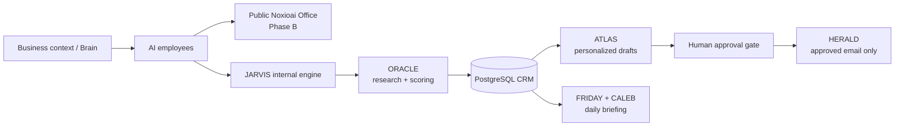

<div align="center">

  

  **AI employees for Iranian businesses — a visual office, one shared business brain, and real work getting done.**

  [](https://noxioai.com)
  [](docs/ROADMAP.md)
  [](jarvis/README.md)

</div>

---

NOXIOAI is building a Persian-first workspace where named AI employees help a business with marketing, development, support, and social operations. The product is designed for the channels that matter to its market, especially Telegram and Instagram, while keeping the business context shared through one **Brain**.

## What is working today

| Surface | Status | What it proves |
|---|---|---|
| [Noxioai landing](https://noxioai.com) | Live | Bilingual FA-first landing page and waitlist |
| [JARVIS](jarvis/README.md) | Internal v1 shipped | Go/Postgres sales operating system used as the proving ground for the future Noxioai engine |
| Public Noxioai Office | Planned | Auth, shared Brain, and pixel-office workflow for Nika, Dara, and Sara |

JARVIS is **not** the public customer product or the completion of Phase B. It is the internal system that validates the useful parts first: research, personalized drafts, approval gates, delivery, daily briefings, and learning from outcomes.

## Current product status

| Phase | Goal | Status |
|---|---|---|
| A — Launch | Landing and waitlist | 🟢 Live; waitlist metric is running |
| B — The Office | Public visual office and shared Brain | 🔨 Next product build; JARVIS is the internal proving ground |
| C — Business | Automations, social tools, first outside users | ⬜ |
| D — Commercial | Billing, plans, PWA | ⬜ |

**Platform build** ([PLATFORM-SPEC.md](PLATFORM-SPEC.md)): session auth ✅ · dashboard shell ✅ · Stripe billing — checkout, portal, webhooks ✅ · production deploy 🔨 in progress

The detailed product plan lives in [docs/ROADMAP.md](docs/ROADMAP.md). The approved technology decisions live in [docs/TECH-STACK.md](docs/TECH-STACK.md).

## Latest activity

<!-- ACTIVITY:START -->
_Auto-updated 2026-07-15 14:51 UTC_

- `0c27144` brand: generated logo set (logomark/lockup/og), header mark, og:image+twitter meta, branded email template with logo + gradient; backup.sh env parsing hardened — 2026-07-15
- `1af51f2` mail: unified transport — Resend HTTPS API in prod (aeza blocks SMTP), SMTP fallback locally; fix token-consume TOCTOU race with atomic UPDATE...RETURNING — 2026-07-15
- `0568a15` wip: brain.go scoring improvements + tests (builds and passes locally) — 2026-07-15
- `7f2463c` infra: DR runbook + server provisioning scripts/systemd units/Caddyfile, netops agent, brand assets — 2026-07-15
- `199f5fa` fix nav/primary CTA buttons: flex centering (waitlist pill text was misaligned) — 2026-07-15
<!-- ACTIVITY:END -->

## JARVIS command center

JARVIS is a local-first agent system for Sobhan's own sales operations. It discovers and scores companies, drafts personalized outreach, requires human approval before outbound delivery, sends approved email through HERALD, and delivers a daily Telegram briefing with CALEB's pipeline memo.


The HUD includes a reactive Three.js data sphere, a live agent network, voice interaction, a startup sequence, a lead board, a human approval gate, and per-agent activity. Screenshots use sample data; no operational CRM data is documented here.

<details>
<summary><strong>Agent dossier</strong></summary>

<br>


</details>

Read the [JARVIS guide](jarvis/README.md) for commands, architecture, environment variables, safety constraints, and deployment details.

## Architecture



## Repository map

```text
Noxioai/
├── pages/ and components/     Nuxt landing page
├── i18n/locales/              Persian-first and English copy
├── assets/                    Landing styles
├── docs/                      Product roadmap and approved stack
├── jarvis/                    Internal Go/Postgres agent engine
│   ├── web/                   Embedded local HUD and startup audio
│   ├── docs/screenshots/      Redacted documentation screenshots
│   ├── SPEC.md                Product contract for JARVIS
│   └── README.md              Operating guide and command reference
└── .github/workflows/         Landing deployment workflow
```

## Technology

| Area | Current implementation |
|---|---|
| Landing | Nuxt 3, Vue 3, TypeScript, Tailwind, `@nuxtjs/i18n`, `@vueuse/motion` |
| Languages | TypeScript, Go, SQL, Bash, YAML |
| Internal engine | Go, `database/sql` + pgx, PostgreSQL 16, OpenAI-compatible model interface |
| JARVIS HUD | Embedded HTML, vendored Three.js, browser-native Web Speech API |
| Operations | Docker Compose for Postgres, local launchd runtime, Telegram and Gmail SMTP integrations |
| Planned public product | Nuxt office UI, Go API, PostgreSQL, session auth, shared business Brain, REST + SSE |

## Run locally

### Landing

```bash
npm install
npm run dev
```

### JARVIS

```bash
cd jarvis
docker compose up -d
go build -o jarvis .
./jarvis db init
./jarvis serve
```

Open `http://127.0.0.1:7700`. See [jarvis/README.md](jarvis/README.md) for configuration and every available command.

## Safety and operating rules

- No outbound message or email is sent before a human approves it.
- Secrets live in local environment files; they are never committed.
- JARVIS binds locally by default and keeps its private memory on the local machine.
- The public product starts only from an approved plan; the internal engine is deliberately small and evidence-driven.

---

Built by [Sobhan Azimzadeh](https://github.com/sobhanaz) × [TECSO](https://github.com/Tecso-Dev).
