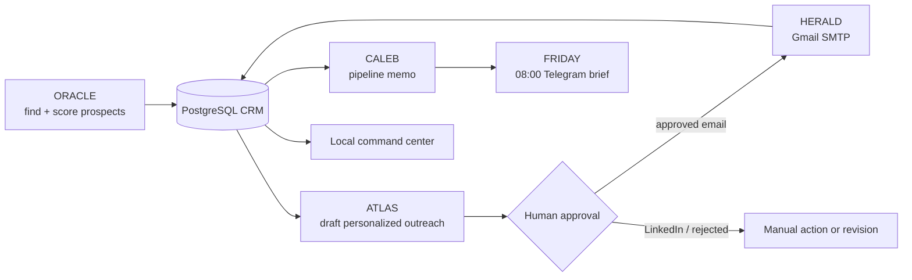

# JARVIS — Internal AI Sales Operating System

> **Status:** v1 shipped and running locally. JARVIS is the internal proving ground for the future NOXIOAI engine — it is not a public customer product or final brand.

JARVIS solves one concrete problem: build and operate a quality sales pipeline for a software agency. It finds prospects, explains why they fit, drafts specific outreach, keeps a human gate before anything leaves the machine, and reports progress every morning.

For the product contract and phase definitions, read [SPEC.md](SPEC.md). For the wider Noxioai product, start at the [repository README](../README.md).

## Shipped milestones

- **Foundation:** Docker Compose PostgreSQL, idempotent schema, pgx-backed Go data access, and a tested agent contract.
- **Research:** ORACLE finds candidate company sites, extracts structured information through the configured model, scores fit, and records reasoning in the CRM.
- **Outreach:** ATLAS produces company-specific email and LinkedIn drafts, rejecting generic copy before storage.
- **Operations:** approvals, outcomes, experience retrieval, FRIDAY's Telegram brief, and CALEB's daily pipeline memo close the learning loop.
- **Delivery:** HERALD can send approved email through Gmail SMTP; nothing is sent without the database approval flag.
- **Command center:** the local HUD combines CRM state, voice interaction, agent activity, dossiers, a reactive data sphere, and the startup sequence.

## Screens


*Local HUD with redacted/sample data.*


*Clicking an agent opens its operational history. The documented screenshot uses sample missions.*

## What it does



| Component | Status | Responsibility |
|---|---:|---|
| ORACLE | Shipped | Web research, site extraction, lead scoring, and CRM upsert |
| ATLAS | Shipped | Personalized email and LinkedIn drafts; stores both unapproved |
| FRIDAY | Shipped | Daily Telegram briefing at 08:00 via launchd |
| CALEB | Shipped | CRM-informed marketing memo with three actions and a content angle |
| HERALD email | Shipped | Sends only an approved email to a stored contact through Gmail SMTP |
| HUD | Shipped | Local dashboard, voice interaction, approval flow, activity, agent dossiers, and startup sequence |
| PIXEL | Planned | Design and motion critic; no production agent implementation yet |
| HERALD social | Planned | Social publishing after the email path proves useful |

## Principles that cannot be bypassed

1. **Human approval before outbound delivery.** ATLAS drafts; Sobhan decides. HERALD rejects unapproved outreach in code.
2. **No generic outreach.** Every draft must name the company and include an observed problem, a relevant offer, and business value.
3. **Every score explains itself.** ORACLE records reasoning, the observed problem, and suggested offer.
4. **Learning is retrieval, not retraining.** Agent runs append CRM experiences; later prompts retrieve lessons from them.
5. **Local-first operations.** Secrets and personal memory stay local; the HUD is bound to `127.0.0.1` by default.

## Requirements

- Go version declared in [go.mod](go.mod)
- Docker Desktop or Docker Engine with Compose
- PostgreSQL 16 through [docker-compose.yml](docker-compose.yml)
- An OpenAI-compatible model endpoint: local Ollama works for chat; DeepSeek, DashScope, or another compatible endpoint can power stronger research/drafting
- A modern browser for the HUD and browser-native voice features

## Quick start

```bash
cd jarvis
docker compose up -d
go build -o jarvis .
./jarvis db init
./jarvis serve
```

Open [http://127.0.0.1:7700](http://127.0.0.1:7700).

The database uses host port `5434` so it can coexist with the local DIGIKALA development stack.

## Configuration

Create `jarvis/.env`; it is intentionally ignored by Git. Real environment variables override values in the file.

| Variable | Purpose | Required for |
|---|---|---|
| `JARVIS_DB_URL` | PostgreSQL connection string; defaults to local Docker Compose | CRM commands and HUD CRM panels |
| `JARVIS_BASE_URL` | OpenAI-compatible API base URL | Model calls |
| `JARVIS_API_KEY` | Model-provider secret | Hosted model providers |
| `JARVIS_MODEL` | Model name | Model calls |
| `JARVIS_TELEGRAM_TOKEN` | Telegram bot token | `brief` / scheduled FRIDAY briefing |
| `JARVIS_TELEGRAM_CHAT` | Telegram destination chat ID | `brief` / scheduled FRIDAY briefing |
| `JARVIS_SMTP_USER` | Gmail sender address | HERALD email |
| `JARVIS_SMTP_PASS` | Gmail app password | HERALD email |
| `JARVIS_ADDR` | HTTP bind address; defaults to `127.0.0.1:7700` | Alternative local port |
| `JARVIS_MEMORY_DIR` | Local profile/fact store | Alternative memory location |

Never commit `.env`, private memory, credentials, leads, or contact data.

## Commands

Build once with `go build -o jarvis .`, then run:

| Command | Result |
|---|---|
| `./jarvis` | Interactive personal assistant REPL |
| `./jarvis serve` | Local HUD, chat endpoint, and control API |
| `./jarvis db init` | Apply the idempotent PostgreSQL schema |
| `./jarvis leads` | Print leads ordered by score |
| `./jarvis oracle "dentists in Warsaw"` | Research and score candidate company sites |
| `./jarvis atlas <lead-id>` | Create unapproved email and LinkedIn drafts |
| `./jarvis approve <outreach-id>` | Approve an outreach item; returns the draft |
| `./jarvis send <outreach-id>` | HERALD sends an approved email only |
| `./jarvis outcome <outreach-id> <sent\|no_reply\|replied\|meeting\|won\|lost>` | Record the result and advance lead status |
| `./jarvis caleb` | Generate CALEB's current marketing memo |
| `./jarvis brief` | Send the FRIDAY briefing to Telegram now |

## HUD and voice interaction

`./jarvis serve` hosts a self-contained local command center. It includes:

- a reactive Three.js data sphere and six-agent network;
- lead, tier, funnel, contact, approval, and experience panels;
- ORACLE, ATLAS, FRIDAY, and HERALD controls;
- an approval modal with a separate HERALD send control;
- per-agent working states, live activity toasts, and click-through dossiers;
- typed chat plus browser-native speech recognition and speech synthesis;
- a bundled startup sound and a rotating original welcome line written into the console and spoken one second later.

Modern browsers may block automatic audio. The header then exposes **Enable Startup SFX**; click it once to play or replay the startup mix.

### Local HTTP surface

| Route | Purpose |
|---|---|
| `GET /` | Command center |
| `GET /health` | Lightweight model/status health response |
| `GET /jarvis-startup.mp3` | Bundled HUD startup audio |
| `POST /chat` | SSE response stream for the browser chat panel |
| `GET /api/status` | HUD data: agents, CRM counts, activity, leads, drafts |
| `GET /api/agent?name=<agent>` | Agent dossier and recent missions |
| `POST /api/oracle` | Start ORACLE research |
| `POST /api/atlas` | Start ATLAS drafting |
| `POST /api/brief` | Trigger FRIDAY briefing |
| `POST /api/approve` | Approve an outreach item |
| `POST /api/send` | Send an approved email through HERALD |

## Data model

The schema is deliberately small:

| Table | Holds |
|---|---|
| `companies` | Candidate company profile and scraped notes |
| `contacts` | Contact names, roles, email, and LinkedIn information |
| `leads` | Score, tier, reasoning, observed problem, offer, and status |
| `outreach` | Drafts, approval state, sending time, and outcome |
| `experiences` | Agent decisions, results, and reusable lessons |

See [schema.sql](schema.sql) for the source of truth.

## Deployment on this Mac

`./deploy.sh` is the local deployment path. It builds and tests the binary, copies it and the existing local `.env` to `~/Library/JARVIS/`, then restarts the local launchd HUD service.

The runtime does not execute from `~/Documents` because macOS TCC can block a launchd process there. The repository remains the source of truth; `~/Library/JARVIS/` is only the runtime copy.

```bash
./deploy.sh
```

## Verification

```bash
go test ./...
```

The test suite covers database round trips when Postgres is available, ORACLE parsing and lead tiers, ATLAS draft quality gates, and HERALD draft parsing. The database test safely skips if Docker is not running.

## Deliberately out of scope

- public multi-user SaaS, billing, and public authentication;
- Redis, Kubernetes, a workflow engine, or a separate vector database;
- automatic LinkedIn or social direct messages;
- outbound email without an explicit approval step;
- copying a real actor's voice or movie dialogue into the product.

## Next decisions

1. Use JARVIS daily and record real outreach outcomes.
2. Prove HERALD email value before adding social publishing.
3. Formalize PIXEL only after it can review real product or campaign work.
4. Turn the proven patterns into the public Noxioai Office after the Phase B plan is approved.
